# Sample Clojure webapp running on clever-cloud

## Why?

There is no official `clojure` & `leiningen` support at the moment on clever-cloud, even if I'm sure that this is totally on track? 😃.

But it's really easy to achieve it by building locally (or Jenkins or whatever) and using the [JAR deployement support of clever-cloud](https://www.clever-cloud.com/doc/java/java-jar/).

## Prerequisites

You will need Java and Leiningen installed on your machine, but if you are already a fan of Clojure, you got this covered.

## Create the application

### Bootstrap

    lein compojure new app

### Edit the app

Then just for fun, bump some versions, in order to use bleeding edge state-of-the-art fully unicorn-approved awesome technology.

Edit **project.clj**:

```clojure
(defproject app "0.1.0-SNAPSHOT"
  :description "FIXME: write description"
  :url "http://example.com/FIXME"
  :min-lein-version "2.0.0"
  :dependencies [[org.clojure/clojure "1.9.0-alpha5"]
                 [compojure "1.5.1"]      
                 [ring/ring-defaults "0.2.1"]
                 [ring/ring-jetty-adapter "1.5.0"]   
                 [ring "1.5.0"]]                     
  :plugins [[lein-ring "0.9.7"]]
  :ring {:handler app.handler/app}
  :profiles
  {:dev {:dependencies [[javax.servlet/servlet-api "2.5"]
                        [ring/ring-mock "0.3.0"]]}}
  :main app.handler)
```

We will need a standalone JAR, in order to do that, our `handler` namespace needs to generate a Java class using `(:gen-class)` and we need a `main` method that starts jetty on port `8080` (default port for a clever-cloud application).

Edit **src/app/handler.clj**:

```clojure
(ns app.handler
  (:gen-class)
  (:require [compojure.core :refer :all]
            [compojure.route :as route]
            [compojure.handler :as handler]
            [ring.adapter.jetty :as jetty]]))

(defroutes app-routes
  (GET "/" [] "Hello World")
  (route/not-found "Not Found"))

(def app
  (handler/site app-routes))

(defn -main [& args]
  (jetty/run-jetty app {:port 8080}))
```

### clever-cloud specifics

As explained on the clever-cloud docs regarding JAR deployment, add a `jar.json` file to the `clevercloud/` directory:

    cat <<EOF > clevercloud/jar.json
    {
      "deploy": {
        "jarName": "target/app-0.1.0-SNAPSHOT-standalone.jar"
      }
    }
    EOF

That way, clever-cloud knows what JAR to deploy & run.

### That's it

Yes, that's all there is to it.

## Build

    lein uberjar
    # add the jar to repository
    git add -f target/app-0.1.0-SNAPSHOT-standalone.jar
    git push -u origin master

## clever-cloud

Go sign-in or create an account on [clever-cloud](https://clever-cloud.com) then load your personal dashbord.

### Add an application

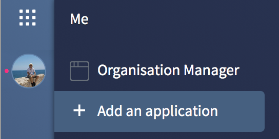

### Create an application from a Github repository

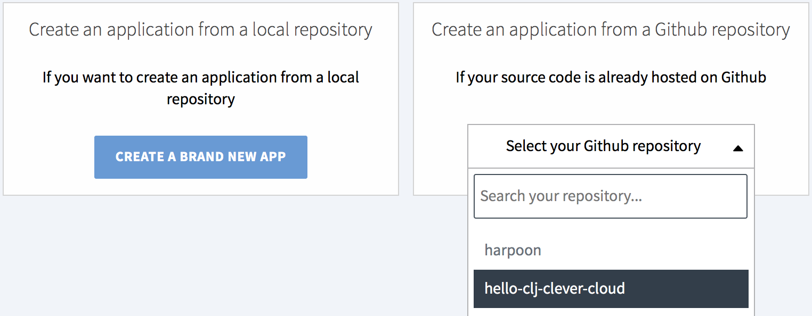

### Select `Java + Maven`

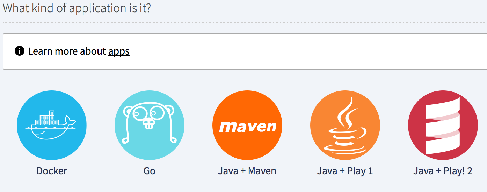

Newly created java applications run on java 8 by default.
You can set the java version with the `JAVA_VERSION` environment variable.

### Edit the instance (if you want)

By default it will select an XS instance, for such a hello world application, I will select a pico instance.

Click the **EDIT** button:
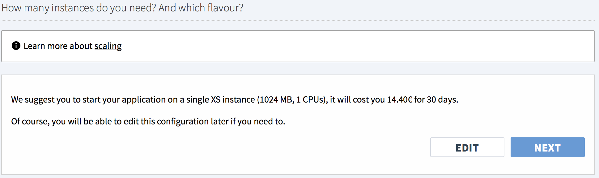

Click the **pico** circle button, then **NEXT**:
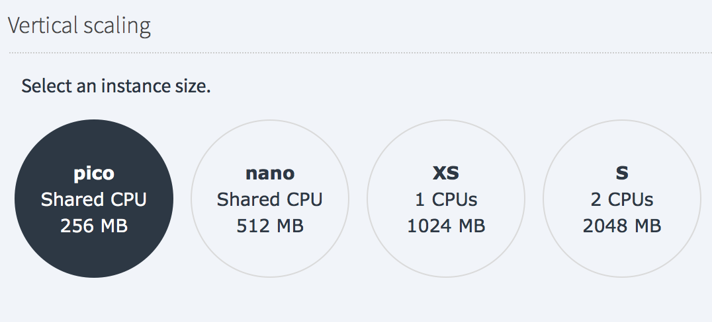

### Create the application

Click the **CREATE** button:
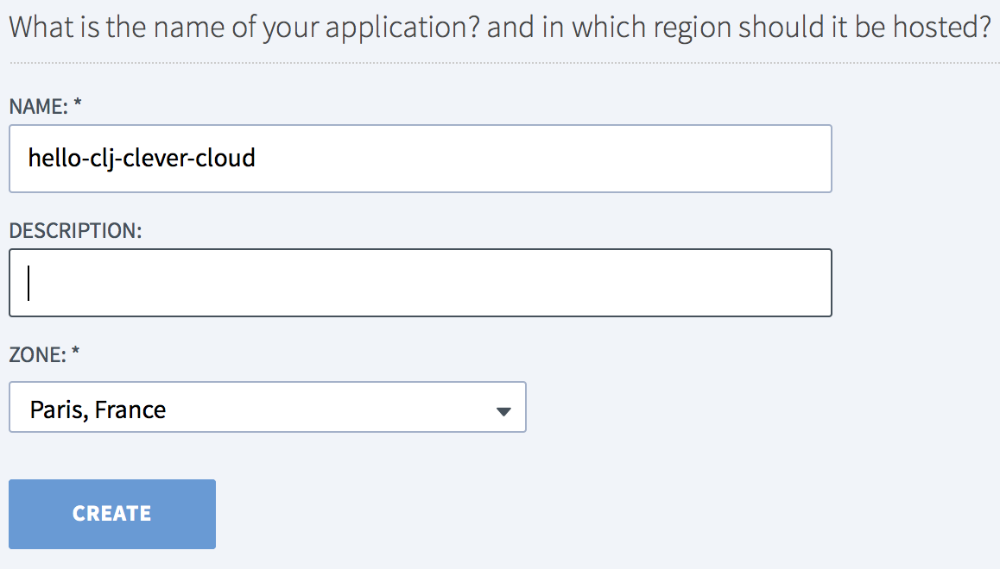

### Select your addons

For this simple hello world app I click **I DON'T NEED ANY ADD-ON**:
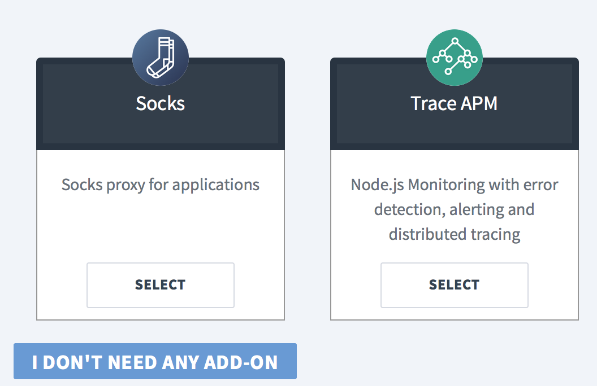

### Start the application

Click the play button under **This app is currently stopped**:
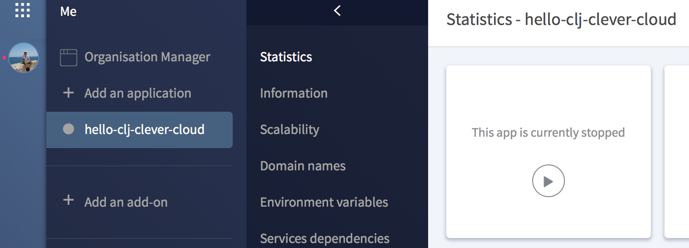

Then click the **read logs** link above that pretty little orange circle:
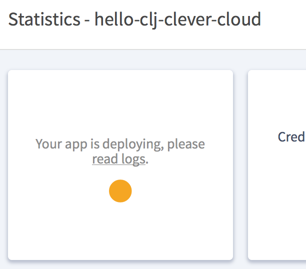

### Wait for the build to success

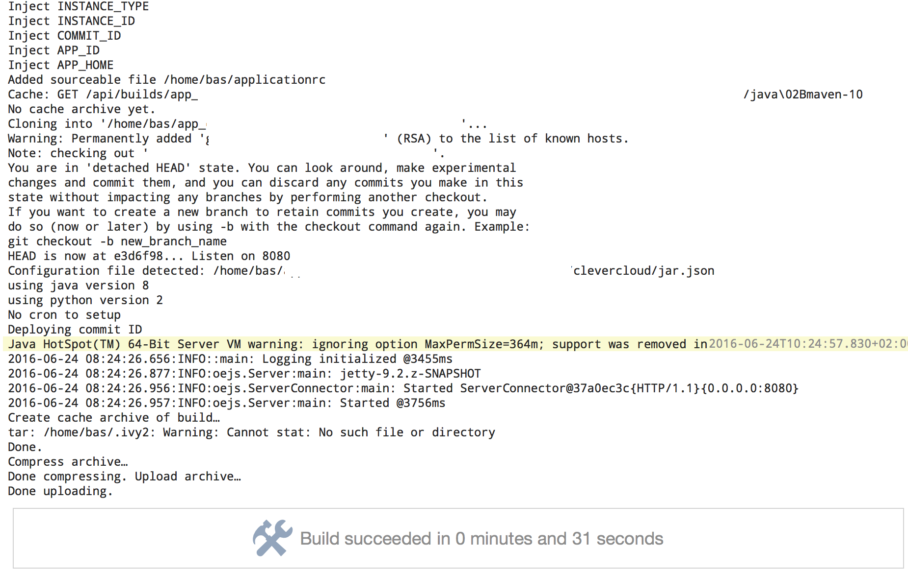

### Wait for the app to deploy

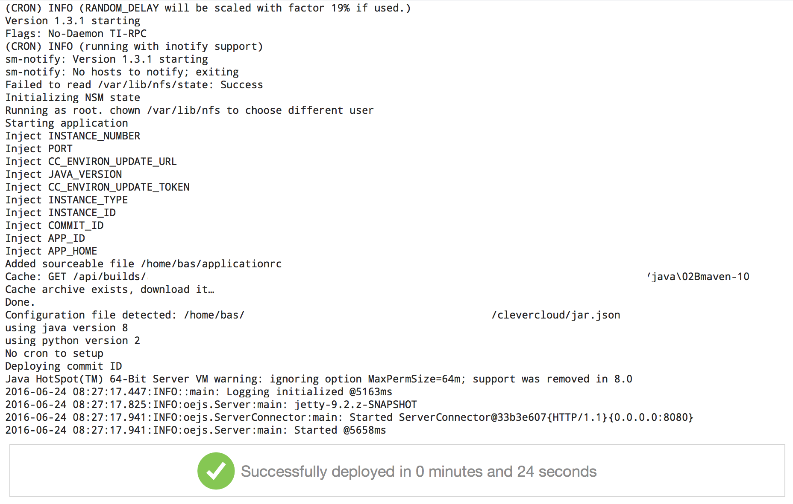

### Check that the application is UP

If you can see that little comforting green circle:

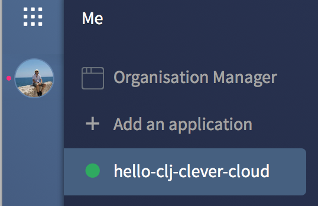

### Open the application

Click that **Open the application** button:
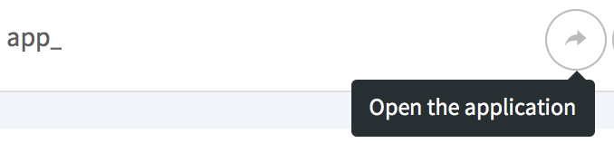

### Profit!

You're awesome.
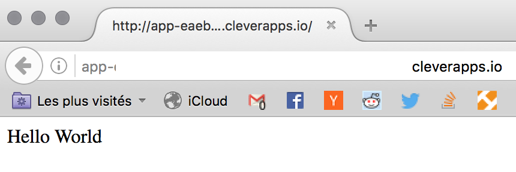

## Downside

- The uberjar can become large.
- You have to build locally and push that artifact.

Hopefully clever-cloud will support clojure and leiningen soon enough? 😃

## Disclaimer

I'm not at all affiliated with clever-cloud even if I find [@waxzce](https://twitter.com/waxzce), [@clementd](https://twitter.com/clementd) and the rest of the clever-cloud team totally awesome for what they have built so far 😎 
